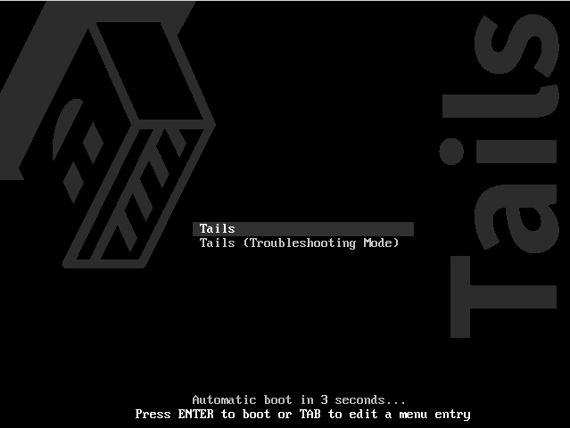
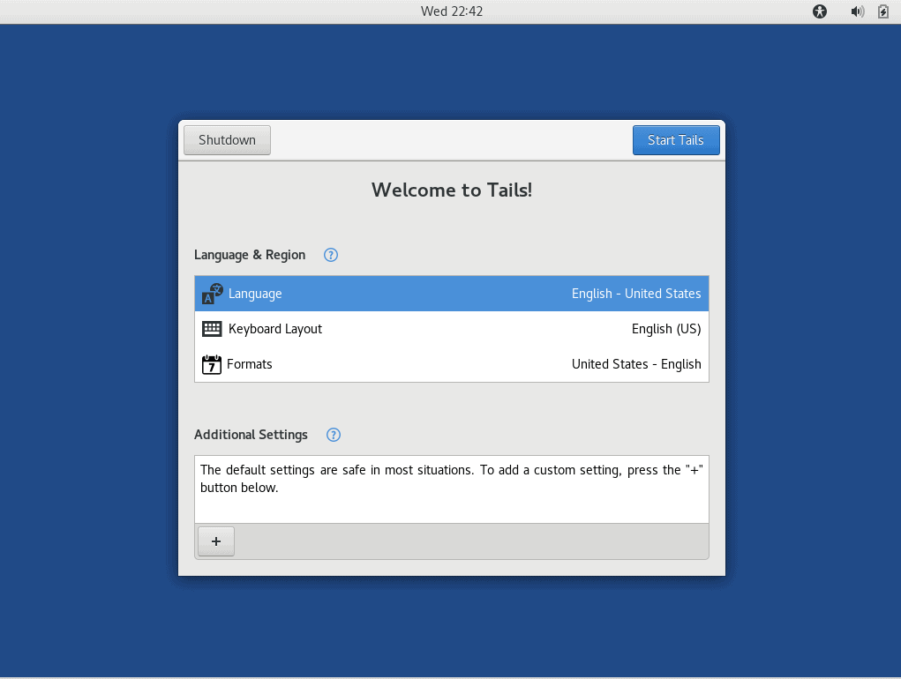

Publishing Anonymously
======================

Whether you are an activist operating under a totalitarian regime, an employee determined to expose some wrongdoings in your company or a vengeful writer composing a bitchy portrait of your ex-wife, you need to protect your identity. If you are not collaborating with others, the focus lies on anonymity and not encryption or privacy. 

If the message is urgent and the stakes are high, one easy way to just get it out quickly is going to an internet cafe one usually does not frequent, create accounts specifically set up for the task, deliver the data and discard those accounts right after that. Do not do anything else while you're there; do not check your Gmail account, do not have a quick one on Facebook and clear all cache, cookies and history and close the browser before you leave.

If you keep these basic rules, the worst – though highly improbable – thing that could happen would be that the offered computer is compromised and logging keystrokes, revealing passwords or even your face, in case an attached webcam is remotely operated. Do not do this at work or in a place where you are a registered member or a regular visitor, like a club or a library.

One of the best ways to get your information out there is to create a blog. While blogging is a great way for sharing but it has it's own set of obstacles. Here we will cover some of the things you need to know before you start your own anonymous blog.

Using a Dedicated Laptop
---

It's advised to use a dedicated laptop. Don't blog on your personal laptop that you use daily. You should buy your burner laptop with cash instead of using a credit card. Never store anything personal on that laptop that could be associated to you. If you are using a password manager such as KeePassXC on your personal machine, don't have a copy of your database on this laptop, create a new database for this machine.

If you bought a used laptop, wipe it. Although you can install a linux distro and start blogging, we recommend using **Tails OS**.

Use passwords for different accounts and choose proper passwords or even passphrases (more about that in the basic tips section). Protect your entire system with a general password, change it often and do not share it with anyone, *especially* not your lover. Install a keystroke logger to see if someone sneaks into your email, especially your lover. Set up your preferences everywhere to log out of every service and platform after 5 minutes of non-use. Keep your superhero identity to yourself.

If you can mantain such level of discipline, you should even be capable of using your own internet connection. But consider this: not using a dedicated system makes it incredibly difficult to keep all the different identities separated in a safe way, and the feeling of safety often leads to carelessness. Keep a healthy level of neurosis.

What is Tails OS?
---

Tails OS is a linux distro based on Debian which forces all connections to go through Tor network. Tails is also amnesic which means everytime you turn off your laptop Tails forgets everything and nothing is stored since everything is stored in the RAM. Each time you boot your system from your USB stick, your system is fresh. If any malware was installed the day before, the next time you boot your system it won't be there.

How To Use Tails OS
---

First off, you need a USB stick (8 GB minimum) or a recordable DVD. To use Tails get the latest version from [Tails download page](https://tails.boum.org/index.en.html).

After downloading the image, verify it. Now we need to flash Tails on our USB stick. You can use [Etcher](https://www.balena.io/etcher/) for this purpose. If you already have another application for flashing USB sticks and you are comfortable with it, use that.

Download the latest version of Etcher and install it on your machine. After the installation, launch the application and select Tails image to burn it on your stick. This may take a few minutes. Close Etcher and but leave the USB stick plugged in.

Restart your machine. Press the boot menu key and select Tails. 

You will see a screen similar to this:

The default settings  are considered safe but if you want to add a custom setting, press '+' icon.

If Tor network is blocked in your country you can use a bridge to bypass that. Now everything you do will pass through Tor network. For more information you can read Tails documentation. Now you're ready to start blogging.

Don't Use Tails Inside a Virtual Machine
---

Although you can download the image from Tails download page and create a virtual machine and blog there instead of booting from the usb stick, we don't recommend that. Why?

The host operating system and the virtualization software are able to monitor your activities. It's also possible that your host machine is compromised.

The virtualization software may also leave traces. Therefore we don't recommend using a virtualization software to run Tails.

Blogging Platforms
---

Today there are many publishing possibilities, from cost-free blogging sites to PasteBins (see glossary). Some blogging platforms include:

1. Github Pages
2. WordPress
3. Blogger
4. Tumblr
5. Write.as

We covered how to set up a burner laptop to run Tails, now it's time to choose one blogging platform.  Each of these platforms have their own pros and cons. For example WordPress is widely used and there are lots of templates and tutorials for it. Although, WordPress is not considered unsafe.

Keep a sane level of cynicism; they all act in commercial interests that you use for 'free' and so cannot be trusted at all, especially in that they may be bound to the demands of a legal jurisdiction that is not your own. All providers are, when it comes down to it, traitors.

If registration with these services requires a working email address, create one dedicated solely to this purpose and do not use personal information for that email account. Avoid Gmail, Yahoo and other big commercial platforms with a history of turning over their users. 

For more on anonymous email, please find the chapter Anonymous email in the previous section.

Public Network vs. Home Network
---

Using Tails daily may raise some suspicions by your ISP or your government. Some suggest using a public network would be a good counter-measure.

Using a public network has few downsides:

1. Public Networks log information about your device (such as your MAC address)
2. If you're using a coffee shop's network, there are CCTV's around which could be used to identify you.

If you decide to use a public network in a library or coffee shop, never leave your machine unattended. Change your MAC address every time you connect to a network. Encrypt all your traffic.

Stylometry
---

Remember that if you are being targeted your adversary may use stylometry to identify you. Stylometry analyzes a person's writing style and it could be used to de-anonymize you. Word choice, sentence structure, syntax and punctuation can be used to de-anonymize you.

There is an application named [Anonymouth](https://github.com/psal/anonymouth) which could be used to anonymize your documents. Unfortunately the installation process is not very easy. One other way to to obfuscate your text is to run your text through a couple of translators. For example:

English > Norwegian > Japanese > English

Several Don'ts
--------------

**Don't register a domain.** There are services that will protect your identity from a simple who is query, like Anonymous Speech or Silent Register, but they will know who you are through your payment data. Unless you have the chance to purchase one using prepaid card or cryptocurrency, limit yourself to one of the domains offered by your blogging platform like yourblogname.blogspot.com and choose a setting outside your native country. Also, find a name that does not give you away easily. If you have problems with that, use a blog name generator online.

**Don't open a social network account associated to your blog.** If you must, keep the level of hygiene that you keep for blogging and never ever login while using your regular browser. If you have a public social network life, avoid it all together. You will eventually make a mistake.

**Don't upload video, photo or audio files** without using an editor to modify or erase all the meta data (photos contain information up to the GPS coordinates of the location the photo was taken at) that standard digital cameras, SmartPhones, recorders and other devices add by default. The *Metadata Anonymisation Toolkit* or *ExifTool* might help you with that.

**Don't leave a history.** Add X-Robots-Tag to your http headers to stop the searching spiders from indexing your website. That should include repositories like the Wayback Machine from archive.org. If you do not know how to do this, search along the lines of "Robots Text File Generator".

**Don't leave comments.** If you must, maintain the levels of hygiene that you use for blogging and always logout when you're done and for god sakes do not troll around. Hell hath no fury like a blogger scorned. 

**Don't expect it to last.** If you hit the pot and become a blogging sensation (like *Belle de Jour*, the British PhD candidate who became a sensation and sold a book and mused two TV shows about her double life as a high escort) there will be a legion of journalists, tax auditors and obsessive fans scrutinizing your every move. You are only human: they will get to you.

**Don't linger.** If you realize you have already made any mistakes but nobody has caught you yet, do close all your accounts, cover your tracks and start a totally new identity. The Internet has infinite memory: one strike, and you're out of the closet.

**Don't reveal personal details.** Don't talk about weather, your setup, your education, your job, etc. This all could be used to identify you.
