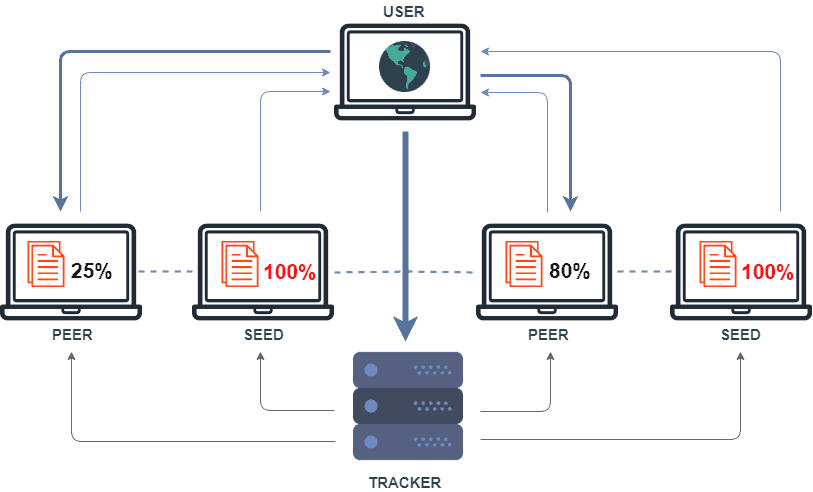
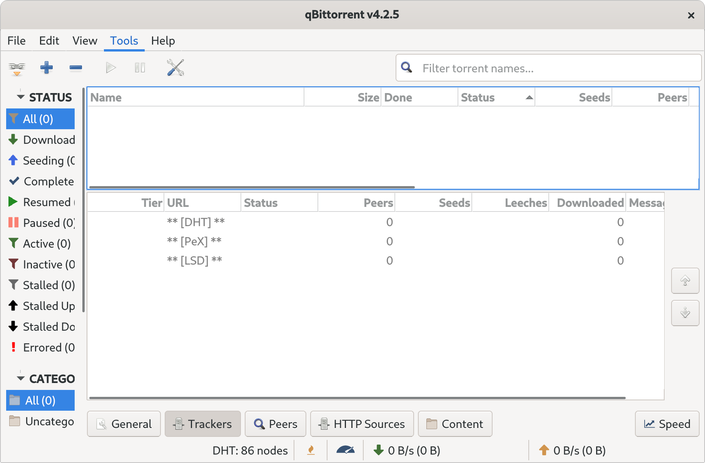
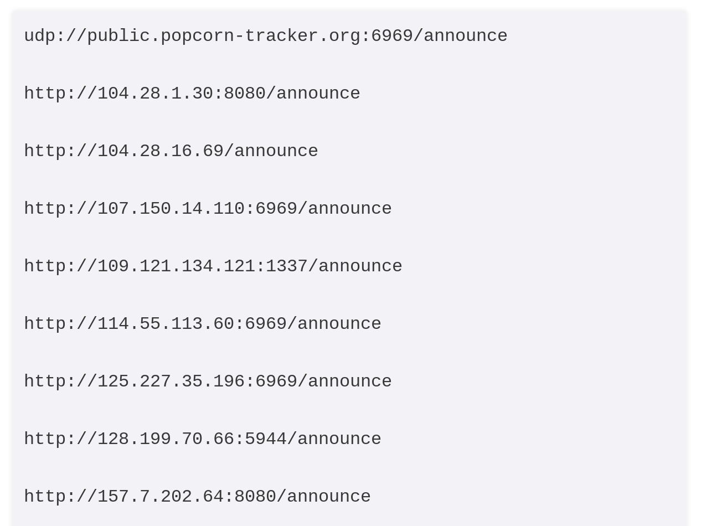
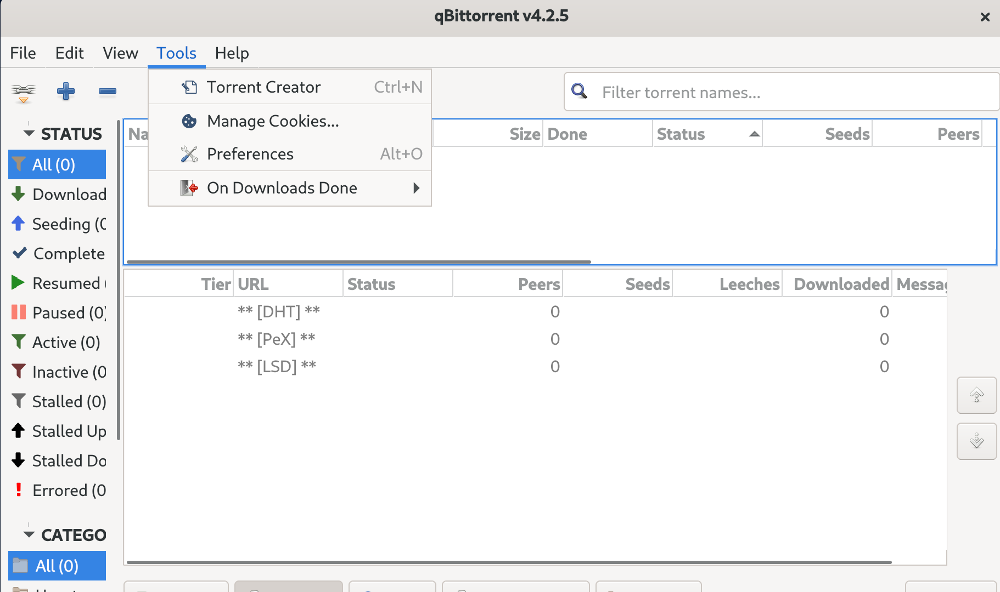
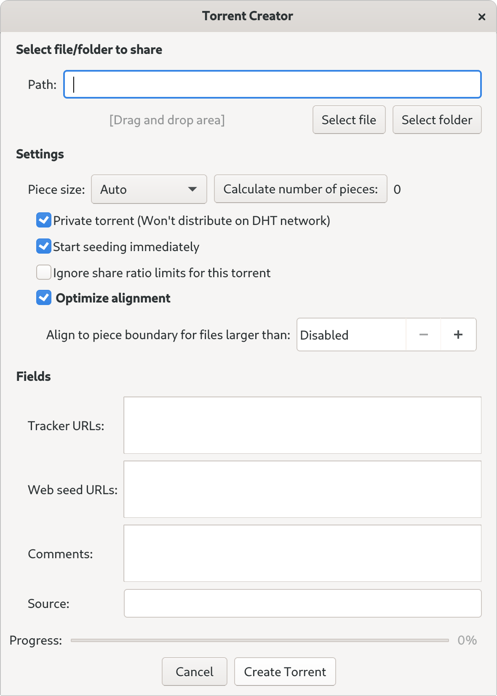

# Torrent

BitTorrent
----------

BitTorrent is a peer-to-peer (P2P) protocol that facilitates distribution of data stored across multiple nodes/participants of the network. There are no central servers or hubs, each node is capable of exchanging data with any other node, sometimes hundreds of them simultaneously. The fact that data is exchanged in parts between numerous nodes allows for great download speeds for popular content on BitTorrent networks, making it quickly the de facto P2P file-sharing platform.

If you are using BitTorrent to circulate material of ambiguous legality, you should know that enforcement agents typically collect information on allegedly infringing peers by participating in torrent swarms, observing and documenting the behaviour of other peers. The large number of users creates a difficulty for the enforcement system simply at the level of scaling up - there simply are not the resources to pursue every user. Any court case will require actual evidence of data transfer between your client and another (and usually evidence of you uploading), it is enough that you provide even part of the file, not the file in its entirety, for a prosecution to have legs. But if you prefer to lean towards greater caution, you should use a VPN to route your BitTorrent traffic, as detailed in the **Using VPN** chapter. 

Leeching (downloading) of a file from BitTorrent network begins with a *torrent file* or *magnet link*. A torrent file is a small file containing information on the larger files you want to download. The torrent file tells your torrent client the names of the files being shared, a URL for the *tracker* and a *hash* code, which is a unique code representing, and derived from, the underlying file - kind of like an ID or catalog number. The client can use that hash to find others seeding (uploading) those files, so you can download from their computers and check the authenticity of the chunks as they arrive.

A *Magnet Link* does away with the need for a torrent file and is essentially a hyperlink containing a description for that torrent, which your torrent client can immediately use to start finding people sharing the file you are willing to download. Magnet links do not require a tracker, instead they rely on *Distributed Hash Table (DHT)* - which you can read more about in the Glossary - and *Peer Exchange*. Magnet links do not refer to a file by its location (e.g. by IP addresses of people who have the file, or URL) but rather defines search parameters by which this file can be found. When a magnet link is loaded, the torrent client initiates an availability search which is broadcast to other nodes and is basically a shout-out "who's got anything matching this hash?!". Torrent client then connects to the nodes which responded to the shout-out and begins to download the file.

BitTorrent uses encryption to prevent providers and other man-in-the-middle from blocking and sniffing your traffic based on the content you exchange. Since BitTorrent swarms (flocks of seeders and leechers) are free for everyone to join it is possible for anyone to join a swarm and gather information about all connected peers. Using magnet links will not prevent you from being seen in a swarm; any of the nodes sharing the same file must communicate between each-other and thus, if just one of the nodes in your swarm is rogue, it will be able to see your IP address. It will also be able to determine if you are seeding the data by sending your node a download request.

One important aspect of using BitTorrent is worth a special mention. Every chunk of data that you receive (leech) is being instantly shared (seeded) with other BitTorrent users. Thus, a process of downloading transforms into a process of (involuntary) publishing, using a legal term - *making available* of that data, before the download is even complete. While BitTorrent is often used to re-distribute freely available and legitimate software, movies, music and other materials, its "making available" capacity created a lot of controversy and led to endless legal battles between copyright holders and facilitators of BitTorrent platforms. At the moment of writing this text, the co-founder of *The Pirate Bay* Gottfrid Svartholm is being detained by Swedish police after an international warrant was issued against him.

For these reasons, and a public relations campaign by copyright holders, use of BitTorrent platforms has become practically analogous to piracy. And while the meaning of terms such as piracy, copyright and ownership in digital context is yet to be settled, many ordinary BitTorrent users have been already prosecuted on the basis of breaking copyright laws.

Most torrent clients allow you to block IP addresses of known copyright trolls using blacklists. Instead of using public torrents one can also join closed trackers or use BitTorrent over VPN or Tor.

In situations when you feel that you should be worried about your BitTorrent traffic and it's anonymity go through the following check-list:

 * Check if your torrent client supports peer-blacklists.
 * Check if the peer-blacklist definitions are updated on a daily basis.
 * Make sure your client supports all recent protocols - DHT, PEX and Magnet links.
 * Choose a torrent client that supports encrypted peers and enable it.
 * Upgrade or change your torrent client if any of the above mentioned options is not available.
 * Use VPN connection to disguise your BitTorrent traffic from your ISP. Make sure your VPN provider allows P2P traffic. See more tips and recommendations in Using VPN chapter.
 * Do not leech and seed stuff you do not know much about.
 * Be suspicious of high ratings and overly-positive comments regarding particular torrent link.
 * 

## Installing qBitTorrent

First you need to install a torrent client. There are many clients out there but we're going to use qBitTorrent since it's open-source and ad-free. It's also available on all platforms.

To get qBitTorrent go to qBitTorrent's website and download the appropriate installer for your machine. Make sure to verify the download before installing it. When you launch it, you would see a window like this:

## Getting Trackers

We need to find trackers for our torrent file. There are many sites that share trackers and you can search for "Torrent Tracker List" and open one of the websites. There are bunch of trackers in each list like this:

Usually one tracker suffices but you can use more than one if you want to. Copy the URL and we're ready to create our torrent file. 

Be sure that the files you're sharing comply with your tracker's rules. Spend some time researching the tracker you're going to use.

## Creating Own Torrent

So far we've covered installing qBitTorrent and getting a tracker for our torrent. Now launch qBitTorrent and navigate to 'Tools' and choose 'Torrent Creator'.

Select the file(s) you want to share and and enter the tracker you copied earlier.

You also need to specify whether your torrent is private or not. If you selected private tracker then you will be asked for the preference of whether you want to keep this torrent private or not.

Now Save the torrent file, and share it with whom you want to  using email or Signal etc.

Check "start seeding immediately".

## Things to consider

- If your file is sensitive, you should encrypt it before sharing it with other people so only it's accessible to whom you want to share it with. 

- Your ISP may know what you're doing. Especially if you're not using a VPN. Try to find a reputable VPN which is suitable for torrenting. In some cases, VPN providers have provided intelligence to law enforcement agencies to help them catch people.

- If you're using a VPN make sure it has a kill switch that shuts down your torrent client when the VPN disconnects.

- Use blocklists in your torrent client. This will reduce your visibility to copyright trolls, ISPs and etc.

- If you're torrenting a file, be sure to read the comments before downloading it. If there is a problem with the torrent, people write about it. Try to stay away from unknown uploaders since you don't want to get your machine infected.
